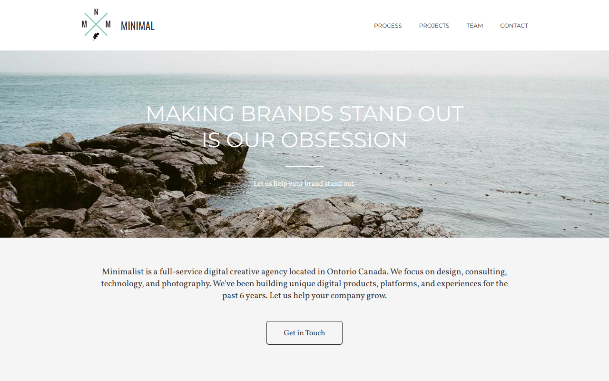

# Minimal



<p>Minimal - digital creative agency Landing Page.</p>

## Installation and Usage

1. Clone the repository:
```
git clone https://github.com/ephraimbinyamin/Minimal.git
```

2. Go to project folder:
```
cd Minimal
```

3. Install NPM packages:
```
npm install
```

4. Start the project:
```
gulp
```

## Dependencies

|      Package      |  Version  |                    Description                      |
|-------------------|-----------|-----------------------------------------------------|
| gulp              | v4.0.2    | Task runner for automating development tasks        |
| gulp-cli          | v2.3.0    | Command-line interface for running Gulp tasks       |
| sass              | v1.62.1   | CSS preprocessor for extending CSS capabilities     |
| gulp-sass         | v5.1.0    | Gulp plugin for compiling Sass into CSS             |
| gulp-clean-css    | v4.3.0    | Gulp plugin for minifying CSS files                 |
| gulp-autoprefixer | v6.1.0    | Gulp plugin for adding vendor prefixes to CSS       |
| gulp-rename       | v1.4.0    | Gulp plugin for renaming files in tasks             |
| gulp-imagemin     | v6.2.0    | Gulp plugin for optimizing and compressing images   |
| gulp-htmlmin      | v5.0.1    | Gulp plugin for minifying HTML files                |
| browser-sync      | v2.26.12  | Development server for synchronized browser testing |